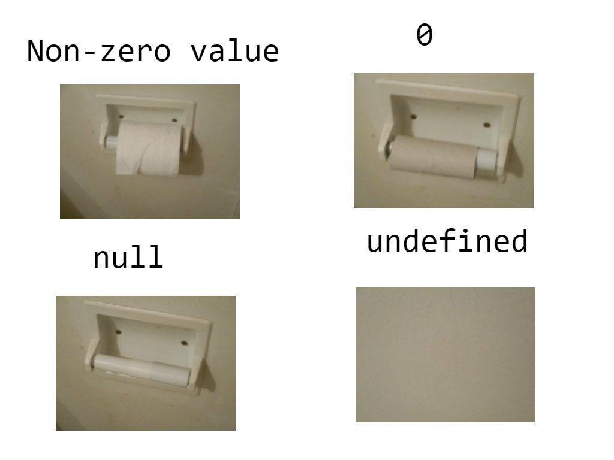

[Cargo cult software engineering](https://archive.org/details/professionalsoft00mcco_0/page/22/mode/2up?q=cargo) is a term coined by Steve McConnell.

> McConnell describes software development organizations that attempt to emulate more successful development houses, either by slavishly following a software development process without understanding the reasoning behind it...
>
> -- [Wikipedia](https://en.wikipedia.org/wiki/Cargo_cult_programming)

It is called "cargo cult" because Feynman used this term to describe pseudoscience

> In the South Seas there is a Cargo Cult of people. During the war they saw airplanes land with lots of good materials, and they want the same thing to happen now. So they’ve arranged to make things like runways, to put fires along the sides of the runways, to make a wooden hut for a man to sit in, with two wooden pieces on his head like headphones and bars of bamboo sticking out like antennas—he’s the controller—and they wait for the airplanes to land. They’re doing everything right. The form is perfect. It looks exactly the way it looked before. But it doesn’t work. No airplanes land. So I call these things **Cargo Cult Science**, because they follow all the apparent precepts and forms of scientific investigation, but they’re missing something essential, because the planes don’t land.
>
> -- [Richard P. Feynman](http://calteches.library.caltech.edu/51/2/CargoCult.htm)

## Intro

Let's step back from programming and see the big picture. People always tried to explain things, to be able to understand it, to be able to reason about it, to able to predict, to be able to make things work the way they want.

Imagine some primordial religion where they would explain lightning as the consequence of thunder god being mad and throwing bolts of lightning. This is an attempt to explain natural phenomena.

Or imagine occult or magical practices, for example, when some tribes do a dance to make it rain. This is an attempt to influence things (but without understanding the nature of it).

It is some kind of a long tradition of humankind to do such things. Some of those attempts were more successful than others - that way science appeared. Science is a successful way to explain things and consequently to be able to predict things or make it work in some useful way.

> it (science) works... bitches!
>
> -- [Richard Dawkins](https://www.youtube.com/watch?v=0OtFSDKrq88)

Unsuccessful attempts, for example, are pseudoscience, mysticism, alchemy, etc. Note: not all fields of human knowledge can be covered by science, for example, there is philosophy and art.

## Back to programming

Programmers are people as well - they try to understand the nature of computation and computers, they try to reason about computers and software, they try to make computers do what they want. And we do the same thing as people did before - we have some set of beliefs about the subject - some beliefs have a reasonable explanation to it and some don't.

I will write a series of posts which shows examples when programming feels like a cult

> cult - a system of religious beliefs and ritual
>
> -- [merriam-webster](https://www.merriam-webster.com/dictionary/cult)

## Undefined and null

JavaScript has two non-values: `undefined` and `null`. Non-values suppose to represent the absence of the value. We have two distinct non-values, so there suppose to be a reason for their existence, right?

[So people try to explain it](https://stackoverflow.com/questions/5076944/what-is-the-difference-between-null-and-undefined-in-javascript):



What [tc39 says](https://tc39.es/ecma262/#sec-undefined-value):

> 4.4.13 undefined value -
> primitive value used when a variable has not been assigned a value
>
> 4.4.15 null value -
> primitive value that represents the intentional absence of any **object** value

So `null` value suppose to represent **intentional** absence of **object** value 🤔.

Let's talk about object bit:

```js
typeof null === "object";
```

This may trick you to think that `typeof` is the reason why `null` is for objects. But turns out there was a bug in the initial implementation of JavaScript, which persisted till those days. See [The history of “typeof null”](https://2ality.com/2013/10/typeof-null.html).

Let's talk about intentional bit. I can use `undefined` intentionally:

```js
let a = undefined; // 🤷‍♀️
({ a: undefined }.hasOwnProperty("a")); // true
```

Let's explore where JS itself uses `undefined`:

```js
var a; // not initialized
let a; // not initialized
({}["test"]); // no value
[][0]; // out of bounds
((x) => x)(); // no argument provided
(() => {})(); // no return value
(() => {
  return;
})(); // no return value
void 0; // evaluate expression and return undefined
```

and `null` - the only places, that I found, that returns `null` are:

> (Deprecated) The `function.caller` property returns the function that invoked the specified function. It returns `null` for strict, async function and generator function callers.
>
> -- [mdn](https://developer.mozilla.org/en-US/docs/Web/JavaScript/Reference/Global_Objects/Function/caller)

> The `Object.setPrototypeOf()` method sets the prototype (i.e., the internal `[[Prototype]]` property) of a specified object to another object or `null`.
>
> -- [mdn](https://developer.mozilla.org/en-US/docs/Web/JavaScript/Reference/Global_Objects/Object/setPrototypeOf)

And some DOM functions, but DOM is not a part of JS specification, it is more like a library.

JS itself doesn't use `null` that much. It is used in deprecated functions or rarely used functions.

`null` is used in [JSON](https://www.json.org/json-en.html), but it was introduced as a library and later was included in the language. And the author of the JSON (Douglas Crockford) [believes that null should be deprecated](https://youtu.be/99Zacm7SsWQ?t=824).

A lot of languages has one non-value:

- Python `NONE`
- Ruby - `nil`
- C `NULL` macro

Even more, the author of `null` - C.A.R. Hoare says that null was [The Billion Dollar Mistake](https://www.infoq.com/presentations/Null-References-The-Billion-Dollar-Mistake-Tony-Hoare/). In Haskell, for example, instead of `null` they use `Maybe` (disjoint union approach):

```hs
data Maybe a = Just a | Nothing
```

**There is no real reason to have two non-values.** It was a programming language design error (it is ok to make errors). But because they exist, people try to explain their existence with something more than legacy code.
